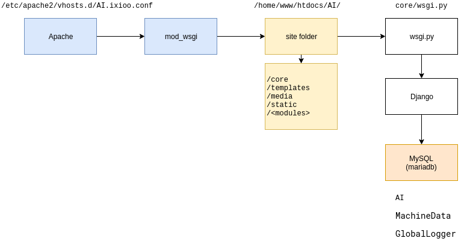

# Install

### Site structure:

    /
        etc/
            apache2/
                vhosts.d/
                    api.ai.ixioo.com.conf
        home/
            www/
                htdocs/
                    AI/
                        static/
                            *.css
                            *.js
                        media/
                            *.csv
                            *.xls
                        templates/
                            *.html
                        core/
                            settings.py
                            local_settings.py
                            *.py
                        <modules>/
                            *.py
                            
                            
                        venv/
                            bin/
                                python
                            lib/
                                python3.6/
                                    site-packages/
                                        django/
                                            *.py
                                        <modules>/
                                            *.py
        
    MySQL databases:
        AI
        MachineData
        GlobalLogger

### Scheme




### Django workflow

[django-workflow](docs/django-workflow.png)


## Installation steps


### Script

OpenSuse:

    ./1-install-opensuse.sh

Ubuntu (for developer PC): 

    ./1-install-ubuntu.sh

### Init

```shell script
# Settings
DOMAIN=ai.ixioo.com

SITE_FOLDER=/home/www/htdocs/AI

APACHE_CONFIG=/etc/apache2/vhosts.d/${DOMAIN}.conf

VENV_PACKAGES_PATH=${SITE_FOLDER}/venv/lib/python3.6/site-packages

DB_NAME=AI
DB_NAME_MachineData=MachineData
DB_NAME_GlobalLogger=GlobalLogger

DB_USER=${DB_NAME}_dbu
DB_PASS=******

SMTP_SERVER=srv6.wahooart.com
SMTP_USER=******
SMTP_PASS=

APACHE_USER=wwwrun
APACHE_GROUP=www
```


### 1. Installing Python

```shell script
_python() {
    _message "Installing Python"
    zypper install python3
    zypper install apache2 apache2-mod_wsgi-python3
}
```


### 2. (for developer PC only) updating hosts

Add record to /etc/hosts for resolve domain.  

```shell script
_hosts() {
    _message "Updating hosts"
    # /etc/hosts
    # for developer only
    cat > /etc/hosts <<EOF
127.0.0.1       $DOMAIN
EOF
}
```

### 2. (for server) check DNS record

```shell script
ping api.ai.ixioo.com 
nslookup api.ai.ixioo.com
```

### 3. Creating Apache config
    
Add config. In config: server name, path to wsgi-script, to python modules, setting permissions.   
 
```shell script
_apache_back_config() {
    _message "Creating Apache config"

    touch ${APACHE_CONFIG}
    chmod a+rw ${APACHE_CONFIG}
    cat > ${APACHE_CONFIG} <<EOF
<VirtualHost *:80>
    ServerName ${DOMAIN}

    DocumentRoot ${SITE_FOLDER}

    CustomLog /var/log/apache2/${DOMAIN}_access.log common
    ErrorLog /var/log/apache2/${DOMAIN}_error.log

    WSGIDaemonProcess ${DOMAIN} user=${APACHE_USER} group=${APACHE_GROUP} python-path=${SITE_FOLDER}:${VENV_PACKAGES_PATH}
    WSGIProcessGroup ${DOMAIN}
    WSGIScriptAlias / ${SITE_FOLDER}/core/wsgi.py

    Alias /static/ ${SITE_FOLDER}/static/

    <Directory ${SITE_FOLDER}/static>
        Require all granted
    </Directory>

    <Directory ${SITE_FOLDER}/core>
        <Files wsgi.py>
            Require all granted
        </Files>
    </Directory>
</VirtualHost>
EOF

    sudo chmod a-w ${APACHE_CONFIG}
}
```

### 4. Coping site files

Copiing files from current folder to site folder. /home/www/htdocs/<doamin>

```shell script
_site() {
    _message "Coping site files"
    [ -d ${SITE_FOLDER} ] &&  _error_message "error: Old site files detected at: ${SITE_FOLDER}" && exit 1
    mkdir ${SITE_FOLDER}
    SELF_PATH="`dirname \"$0\"`"
    cd ${SELF_PATH}
    rsync -aq . ${SITE_FOLDER}/ --exclude venv --exclude .git --exclude .idea
}
```


### 5. Setting site permissions

For save user uploaded files (like a .csv, .xls) need access: RW to folder <site>/media

```shell script
_site_permissions() {
    _message "Setting site permissions"
    chmod -R a+r ${SITE_FOLDER}
    cd ${SITE_FOLDER}
    [ -d ${SITE_FOLDER}/media ] || mkdir ${SITE_FOLDER}/media
    chown -R APACHE_USER:APACHE_GROUP ${SITE_FOLDER}/media
    chmod -R ug+rw ${SITE_FOLDER}/media
    chmod -R a+r ${SITE_FOLDER}/media
}
```    


### 6. Creating Python venv

For separate Python site modules from system modules creating environment. 
 
 ```shell script
_python_venv() {
    _message "Creating Python venv"
    cd ${BACK_FOLDER}
    python3 -m venv venv
}
```


### 7. Installing MySQL server (mariadb)

DB server. MariaDB it is fork MySQL. 

For access to mysql from python needed library mysqlclient. For compile mysqlclient needed python3-devel libmariadb-devel and C and C libs.

```shell script
_mysql() {
    _message "Installing MySQL server (mariadb)"
    zypper install gcc7-c++ gcc-c++ libstdc++6-devel-gcc7 python3-devel libmariadb-devel
    zypper install mariadb
}
```


### 8. Creating MySQL databases

Databases: AI, MachineData, GlobalLogger.

```shell script
_mysql_db() {
    _message "Creating MySQL DB"
    mysql -u root -p <<EOF
    CREATE DATABASE IF NOT EXISTS ${DB_NAME} DEFAULT CHARACTER SET utf8 DEFAULT COLLATE utf8_general_ci;
    GRANT ALL PRIVILEGES ON ${DB_NAME}.* TO ${DB_USER}@'%' IDENTIFIED BY '${DB_PASS}';

    CREATE DATABASE IF NOT EXISTS ${DB_NAME_MachineData} DEFAULT CHARACTER SET utf8 DEFAULT COLLATE utf8_general_ci;
    GRANT ALL PRIVILEGES ON ${DB_NAME_MachineData}.* TO ${DB_USER}@'%' IDENTIFIED BY '${DB_PASS}';

    CREATE DATABASE IF NOT EXISTS ${DB_NAME_GlobalLogger} DEFAULT CHARACTER SET utf8 DEFAULT COLLATE utf8_general_ci;
    GRANT ALL PRIVILEGES ON ${DB_NAME_GlobalLogger}.* TO ${DB_USER}@'%' IDENTIFIED BY '${DB_PASS}';

    FLUSH PRIVILEGES;
EOF
}
```


### 9. Installing requiremtns

Here installing Django, django modules, Excel reader modules, Tensorflowm/TensorBoard and other python modules.  

```shell script
_python_requirements() {
    _message "Installing requiremnts"

    zypper install gcc7-c++ gcc-c++ libstdc++6-devel-gcc7 python3-devel libmariadb-devel
    zypper install zlib zlib-devel

    cd ${SITE_FOLDER}
    source venv/bin/activate
    pip install pip --upgrade
    pip install -r requirements.txt
}
```


### 10. Creating Django settigns

For separate dev settings and server settings using file: core/settings_local.py

Here logins/passwords and pathes, platform specific.

```shell script
_django_local_settings() {
    _message "Creating Django local settigns"
    # local_settings
    cat > ${SITE_FOLDER}/core/local_setting.py <<EOF
EMAIL_USE_TLS = False
EMAIL_HOST = '${SMTP_SERVER}'
EMAIL_HOST_USER = '${SMTP_USER}'
EMAIL_HOST_PASSWORD = '${SMTP_PASS}'
EMAIL_PORT = 25

DATABASE_ENGINE = 'django.db.backends.mysql'

DATABASES = {
    'default': {
        'ENGINE': 'django.db.backends.mysql',
        'NAME': '${DB_NAME}',
        'USER': '${DB_USER}',
        'PASSWORD': '${DB_PASS}',
        'HOST': 'localhost',
        'PORT': '3306',
        'OPTIONS': {
            'sql_mode': 'traditional',
        }
    },
    'MachineData': {
        'ENGINE': 'django.db.backends.mysql',
        'NAME': '${DB_NAME_MachineData}',
        'USER': '${DB_USER}',
        'PASSWORD': '${DB_PASS}',
        'HOST': 'localhost',
        'PORT': '3306',
        'OPTIONS': {
            'sql_mode': 'traditional',
        }
    }
}
EOF
}
```


### 11. Creating Django tables

After install need create tables: users, groups, auth, machines, billings, graphs, and other.

DB tables created from models. It does in 2 steps: create migrations, migrate.

Because tables have foreign keys, needed migrate in specific order,    

```shell script
_django_tables() {
    _message "Creating Django tables"
    cd ${SITE_FOLDER}
    source venv/bin/activate
    ./manage.py migrate
}
```


### 12. Creating Django superuser

For access to <site>/admin needed superuser.

Django superuser is admin.

Django superuser often 'admin', 'admin@localhost'.

Created by ./manage.py script also. 

```shell script
_django_superuser() {
    _message "Creating Django superuser"
    cd ${SITE_FOLDER}
    source venv/bin/activate
    ./manage.py createsuperuser
}
```
    

### 13. Reloading Apache

Reload apache for load new config.

```shell script
_restart_apache() {
    _message "Reloading Apache"
    systemctl reload apache2
}
```


### 14. All done!

Site ready: http://ai.ixioo.com

