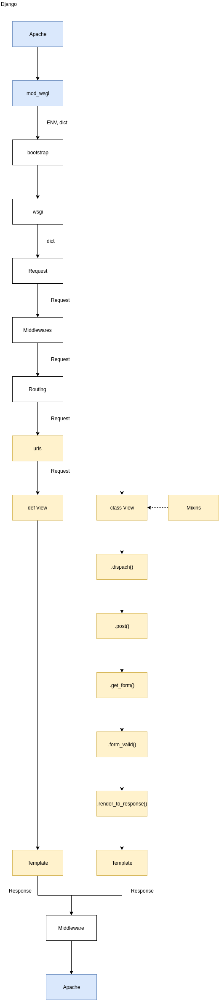

## install 
See descriptin in [INSTALL.md]()

Script:

    ./1-install-<platform>.sh
    
## Deploy
    ./deploy.sh

### Django workflow

## Send logic
- phase 1 (uploading)
    - upload file xls / csv
    - read
      - detect column names 
      - detect column types
    - create SQL table
    - insert data into SQL

- phase 2 (PreAnalyser)
    - run PreAnalyser
    - if OK:
        - go to phase 3 
    - if FAIL: 
        - show errors

 
- phase 3 (NN parameters)
